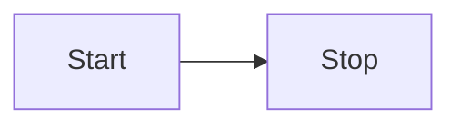
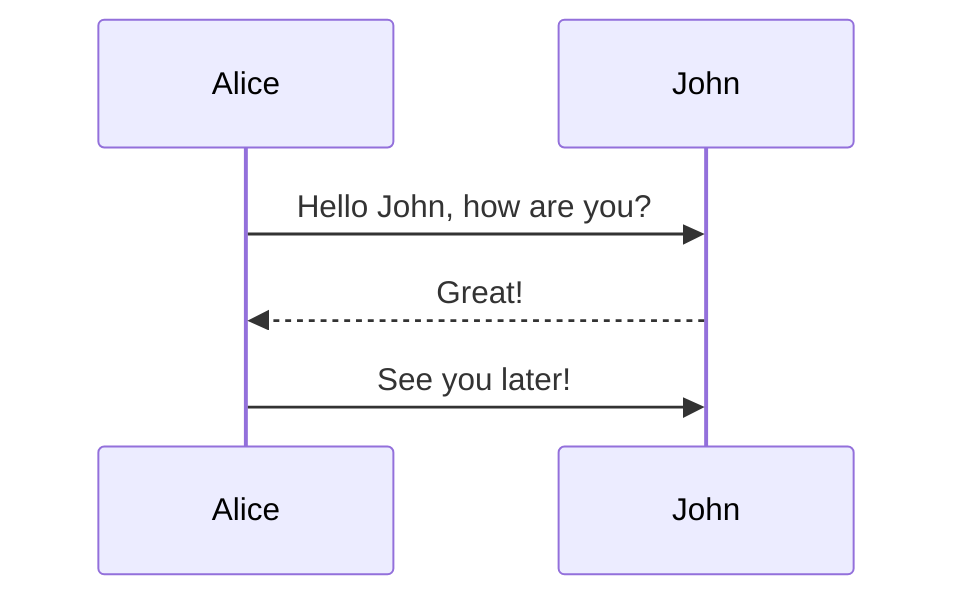
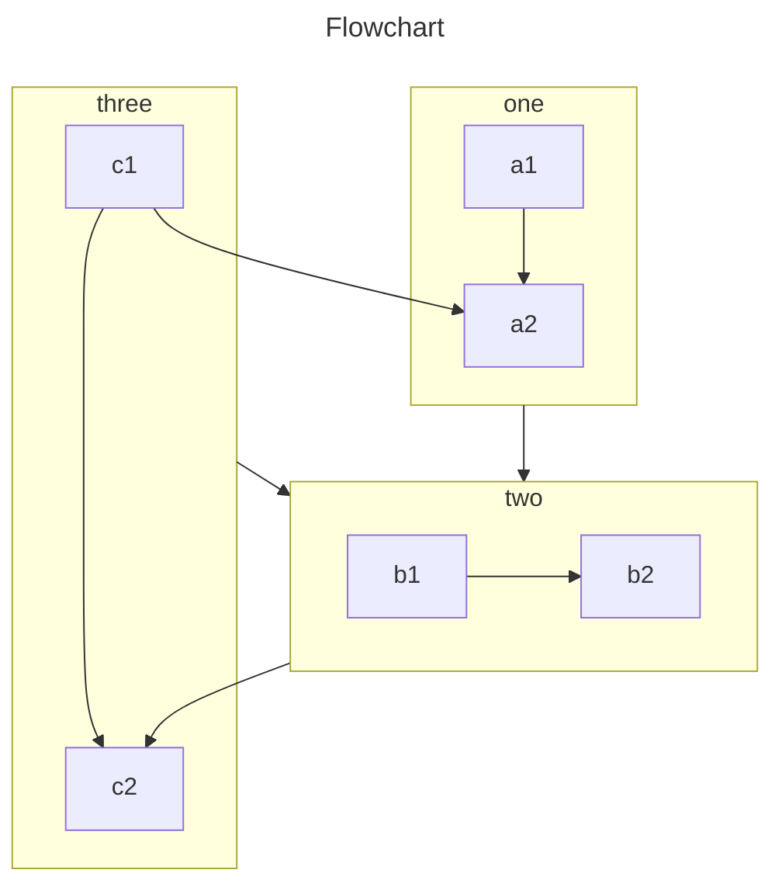
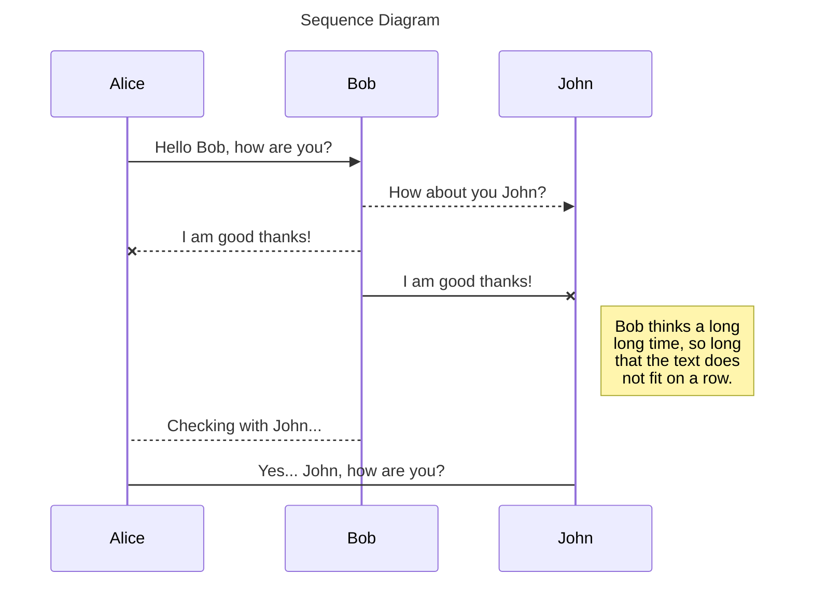
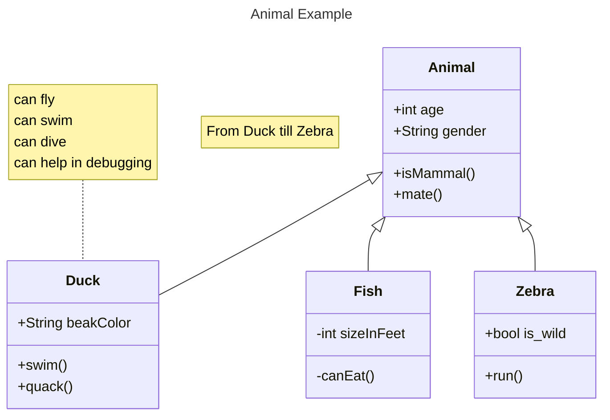
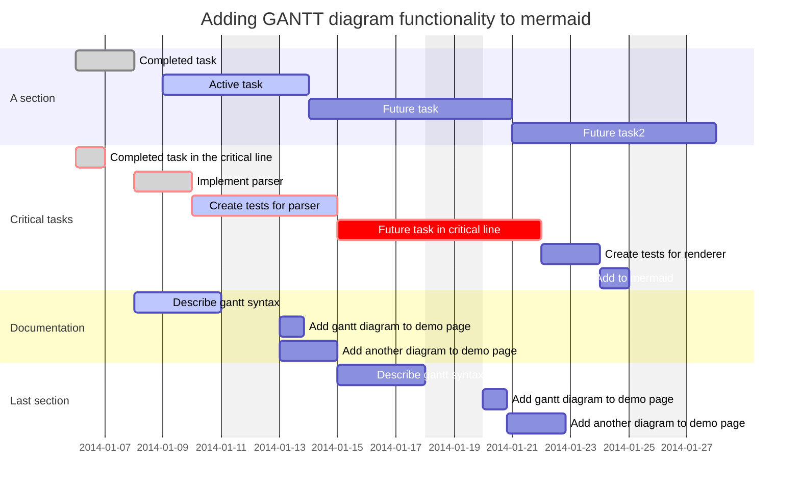

# Mermaid

Mermaid diagram plugin, supporting Mermaid chart rendering in Markdown.

## Installation

::: npm-to

```sh
npm install vitepress-plugin-mermaid-next
```

:::

## Usage

### vitepress-tuck Mode <Badge type="tip">Recommended</Badge>

```ts [.vitepress/config.ts]
import { defineConfig } from 'vitepress-tuck'
import mermaid from 'vitepress-plugin-mermaid-next'

export default defineConfig({
  plugins: [
    mermaid(),
  ],
})
```

[Learn more about **vitepress-tuck**](../guide/quick-start.md){.readmore}

### Native Mode

```ts [.vitepress/config.ts]
import { defineConfig } from 'vitepress'
import { mermaidMarkdownPlugin, mermaidVitePlugin } from 'vitepress-plugin-mermaid-next'

export default defineConfig({
  vite: {
    plugins: [mermaidVitePlugin({
      options: { theme: 'default' },
    })],
  },
  markdown: {
    config: (md) => {
      md.use(mermaidMarkdownPlugin)
    },
  },
})
```

```ts [.vitepress/theme/index.ts]
import type { Theme } from 'vitepress'
import { enhanceAppWithMermaid } from 'vitepress-plugin-mermaid-next/client'
import DefaultTheme from 'vitepress/theme'

export default {
  extends: DefaultTheme,
  enhanceApp(ctx) {
    enhanceAppWithMermaid(ctx)
  },
} satisfies Theme
```

## Syntax

Use code blocks with the `mermaid` language tag:

````md

````

````md

````

## Configuration

### MermaidPluginOptions

```ts
interface MermaidPluginOptions {
  /**
   * Mermaid configuration (excluding startOnLoad and themeVariables)
   */
  options?: Omit<MermaidConfig, 'startOnLoad' | 'themeVariables'> & {
    themeVariables?: MermaidThemeVariables
  }

  /**
   * Locale configuration
   */
  locales?: Record<string, MermaidLocaleData>
}
```

### MermaidThemeVariables

Supports custom theme variables for various Mermaid diagram types, covering:

- Basic variables (background, text color, line color, etc.)
- C4, Class, ER diagram variables
- Flowchart variables
- Gantt chart variables
- Git graph variables
- Journey diagram variables
- Pie chart variables
- Requirement diagram variables
- State diagram variables
- Sequence diagram variables

### MermaidLocaleData

```ts
interface MermaidLocaleData {
  chart?: string       // Default 'Chart'
  source?: string      // Default 'Source'
  fullscreen?: string  // Default 'Fullscreen'
  download?: string    // Default 'Download'
}
```

## Built-in Languages

The plugin includes built-in support for the following languages:

- English (en, en-US)
- 简体中文 (zh, zh-CN)
- 日本語 (ja)
- 한국어 (ko)
- Español (es)
- Français (fr)
- Русский (ru)
- Deutsch (de)
- Português (pt)

## Examples








