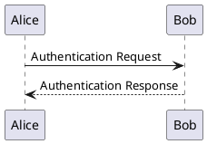
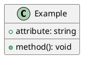
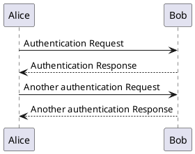
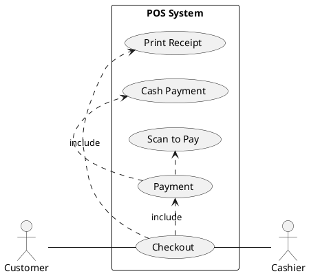
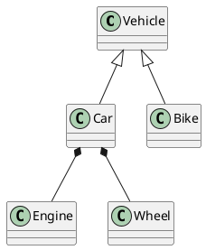
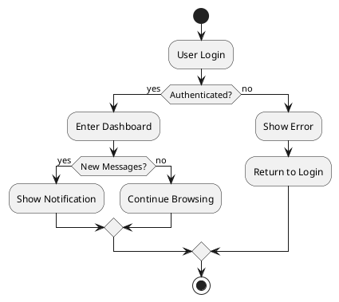

# PlantUML

<NpmBadge name="vitepress-plugin-plantuml" />

PlantUML diagram plugin, supporting PlantUML chart rendering in Markdown.

## Installation

::: npm-to

```sh
npm install vitepress-plugin-plantuml
```

:::

## Usage

### vitepress-tuck Mode <Badge type="tip">Recommended</Badge>

```ts [.vitepress/config.ts]
import { defineConfig } from 'vitepress-tuck'
import plantuml from 'vitepress-plugin-plantuml'

export default defineConfig({
  plugins: [
    plantuml(),
  ],
})
```

[Learn more about **vitepress-tuck**](../guide/quick-start.md){.readmore}

### Native Mode

```ts [.vitepress/config.ts]
import { defineConfig } from 'vitepress'
import { plantumlMarkdownPlugin, plantumlVitePlugin } from 'vitepress-plugin-plantuml'

export default defineConfig({
  vite: {
    plugins: [plantumlVitePlugin()],
  },
  markdown: {
    config: (md) => {
      md.use(plantumlMarkdownPlugin)
    },
  },
})
```

```ts [.vitepress/theme/index.ts]
import type { Theme } from 'vitepress'
import { enhanceAppWithPlantuml } from 'vitepress-plugin-plantuml/client'
import DefaultTheme from 'vitepress/theme'

export default {
  extends: DefaultTheme,
  enhanceApp(ctx) {
    enhanceAppWithPlantuml(ctx)
  },
} satisfies Theme
```

## Syntax

Use code blocks with the `plantuml` language tag:

````md

````

### Output Format

The plugin supports `svg` (default) and `png` output formats. You can specify the format per diagram:

````md

````

Or set a global default:

```ts
plantuml('png') // default is 'svg'
```

## Configuration

### PlantumlPluginOptions

```ts
interface PlantumlPluginOptions {
  /**
   * Output format, 'svg' | 'png'
   * @default 'svg'
   */
  format?: PlantumlFormat
}
```

## Features

- **Dark / Light mode** — Automatically generates both dark and light diagram variants, following the VitePress theme
- **Chart / Source tabs** — Toggle between the rendered diagram and its PlantUML source code
- **Fullscreen mode** — Click the fullscreen button to view the diagram in an overlay
- **Download** — Download the current diagram as an image file
- **Multi-language** — Built-in support for English, Chinese, Japanese, Korean, Spanish, French, Russian, German, and Portuguese
- **SVG optimization** — SVGs are automatically optimized via SVGO, removing redundant styles and background layers
- **Build caching** — Rendered diagrams are cached to disk for faster incremental builds

## Built-in Languages

The plugin includes built-in support for the following languages:

- English (en, en-US)
- 简体中文 (zh, zh-CN)
- 日本語 (ja)
- 한국어 (ko)
- Español (es)
- Français (fr)
- Русский (ru)
- Deutsch (de)
- Português (pt)

## Examples

### Sequence Diagram



### Use Case Diagram



### Class Diagram



### Activity Diagram


