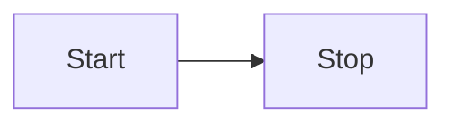
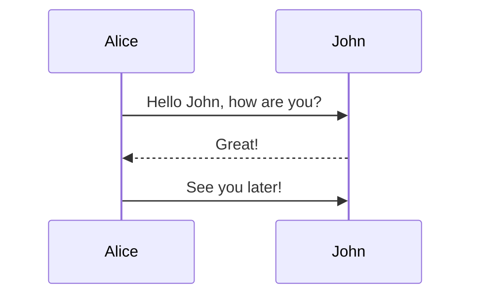
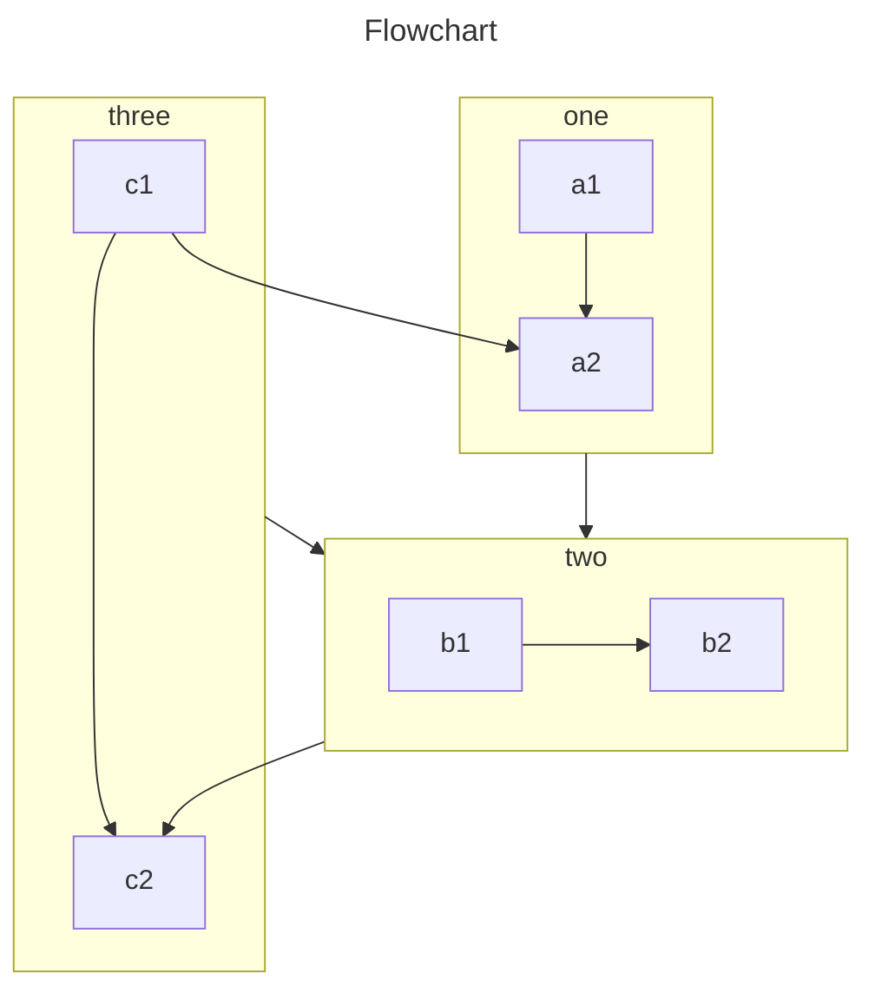
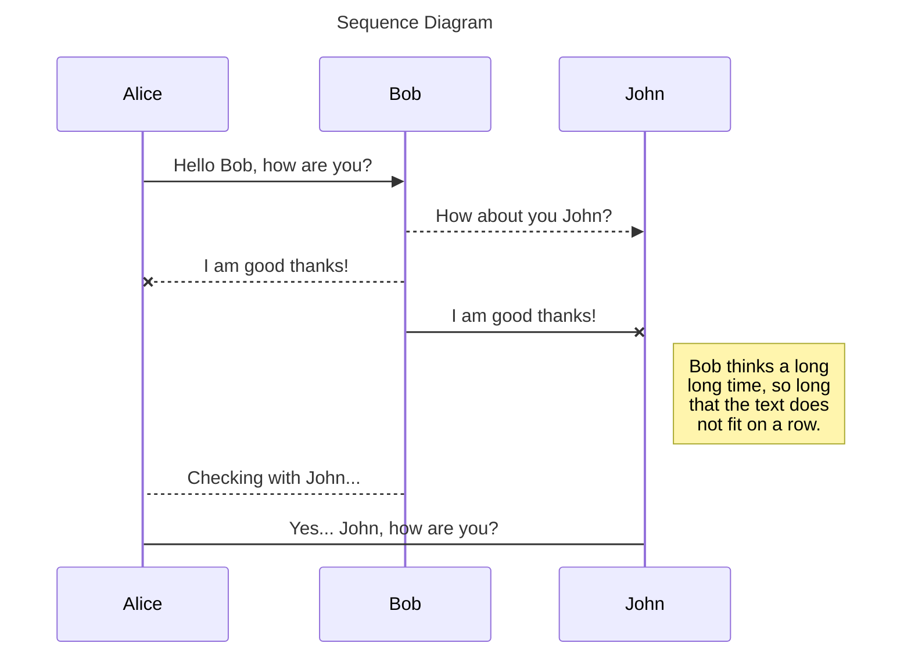
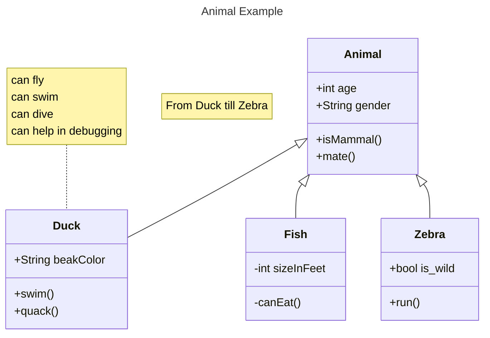
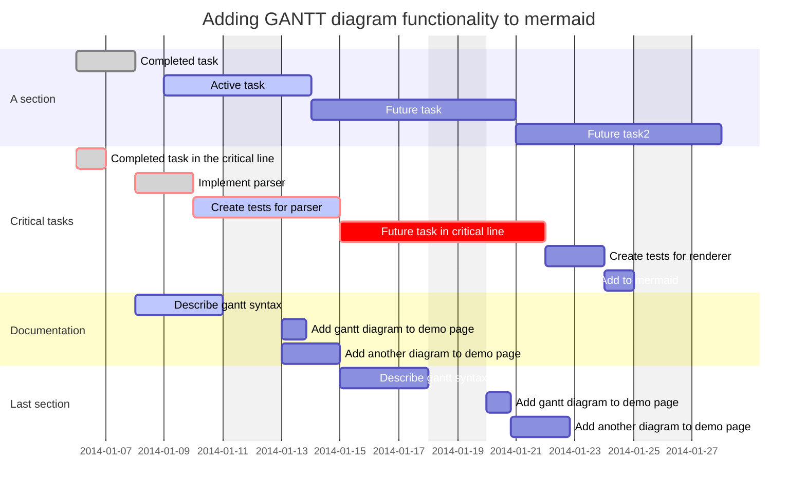

# Mermaid

<NpmBadge name="vitepress-plugin-mermaid-tuck" />

Mermaid 图表插件，支持在 Markdown 中渲染 Mermaid 图表。

## 安装

::: npm-to

```sh
npm install vitepress-plugin-mermaid-tuck
```

:::

## 使用

### vitepress-tuck 模式 <Badge type="tip">推荐</Badge>

```ts [.vitepress/config.ts]
import { defineConfig } from 'vitepress-tuck'
import mermaid from 'vitepress-plugin-mermaid-tuck'

export default defineConfig({
  plugins: [
    mermaid(),
  ],
})
```

[查看 **vitepress-tuck** 了解更多](../guide/quick-start.md){.readmore}

### 传统模式

```ts [.vitepress/config.ts]
import { defineConfig } from 'vitepress'
import { mermaidMarkdownPlugin, mermaidVitePlugin } from 'vitepress-plugin-mermaid-tuck'

export default defineConfig({
  vite: {
    plugins: [mermaidVitePlugin({
      options: { theme: 'default' },
    })],
  },
  markdown: {
    config: (md) => {
      md.use(mermaidMarkdownPlugin)
    },
  },
})
```

```ts [.vitepress/theme/index.ts]
import type { Theme } from 'vitepress'
import { enhanceAppWithMermaid } from 'vitepress-plugin-mermaid-tuck/client'
import DefaultTheme from 'vitepress/theme'

export default {
  extends: DefaultTheme,
  enhanceApp(ctx) {
    enhanceAppWithMermaid(ctx)
  },
} satisfies Theme
```

## 语法

使用 `mermaid` 语言标记的代码块：

````md

````

````md

````

## 配置

### MermaidPluginOptions

```ts
interface MermaidPluginOptions {
  /**
   * Mermaid 配置项（排除 startOnLoad 和 themeVariables）
   */
  options?: Omit<MermaidConfig, 'startOnLoad' | 'themeVariables'> & {
    themeVariables?: MermaidThemeVariables
  }

  /**
   * 多语言配置
   */
  locales?: Record<string, MermaidLocaleData>
}
```

### MermaidThemeVariables

支持对 Mermaid 各类图表的主题变量进行自定义，涵盖：

- 基础变量（背景色、文字颜色、线条颜色等）
- C4、Class、ER 图变量
- Flowchart 变量
- Gantt 图变量
- Git 图变量
- Journey 图变量
- Pie 图变量
- Requirement 图变量
- State 图变量
- Sequence 图变量

### MermaidLocaleData

```ts
interface MermaidLocaleData {
  chart?: string       // 默认 'Chart'
  source?: string      // 默认 'Source'
  fullscreen?: string  // 默认 'Fullscreen'
  download?: string    // 默认 'Download'
}
```

## 内置语言

插件内置了以下语言的支持：

- English (en, en-US)
- 简体中文 (zh, zh-CN)
- 日本語 (ja)
- 한국어 (ko)
- Español (es)
- Français (fr)
- Русский (ru)
- Deutsch (de)
- Português (pt)

## 示例








