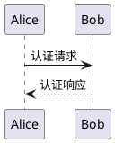
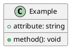
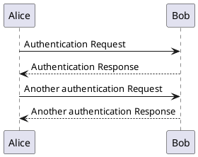
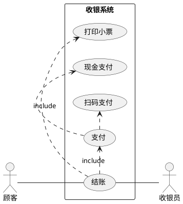
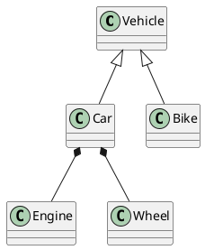
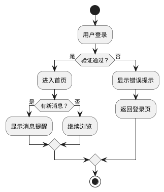

# PlantUML

<NpmBadge name="vitepress-plugin-plantuml" />

PlantUML 图表插件，支持在 Markdown 中渲染 PlantUML 图表。

## 安装

::: npm-to

```sh
npm install vitepress-plugin-plantuml
```

:::

## 使用

### vitepress-tuck 模式 <Badge type="tip">推荐</Badge>

```ts [.vitepress/config.ts]
import { defineConfig } from 'vitepress-tuck'
import plantuml from 'vitepress-plugin-plantuml'

export default defineConfig({
  plugins: [
    plantuml(),
  ],
})
```

[查看 **vitepress-tuck** 了解更多](../guide/quick-start.md){.readmore}

### 传统模式

```ts [.vitepress/config.ts]
import { defineConfig } from 'vitepress'
import { plantumlMarkdownPlugin, plantumlVitePlugin } from 'vitepress-plugin-plantuml'

export default defineConfig({
  vite: {
    plugins: [plantumlVitePlugin()],
  },
  markdown: {
    config: (md) => {
      md.use(plantumlMarkdownPlugin)
    },
  },
})
```

```ts [.vitepress/theme/index.ts]
import type { Theme } from 'vitepress'
import { enhanceAppWithPlantuml } from 'vitepress-plugin-plantuml/client'
import DefaultTheme from 'vitepress/theme'

export default {
  extends: DefaultTheme,
  enhanceApp(ctx) {
    enhanceAppWithPlantuml(ctx)
  },
} satisfies Theme
```

## 语法

使用 `plantuml` 语言标记的代码块：

````md

````

### 输出格式

插件支持 `svg`（默认）和 `png` 两种输出格式。可在代码块中指定：

````md

````

或全局配置默认格式：

```ts
plantuml('png') // 默认为 'svg'
```

## 配置

### PlantumlPluginOptions

```ts
interface PlantumlPluginOptions {
  /**
   * 输出格式，可选 'svg' | 'png'
   * @default 'svg'
   */
  format?: PlantumlFormat
}
```

## 功能特性

- **明暗主题适配** — 自动生成明暗两套图表，跟随 VitePress 主题切换
- **图表 / 源码切换** — 在渲染结果和 PlantUML 源码之间切换查看
- **全屏查看** — 点击全屏按钮以浮层方式查看图表
- **图片下载** — 一键下载当前图表为图片文件
- **多语言支持** — 内置中、英、日、韩、西、法、俄、德、葡九种语言
- **SVG 优化** — 输出 SVG 时自动通过 SVGO 优化，移除冗余样式和背景层
- **构建缓存** — 渲染结果缓存到磁盘，加速增量构建

## 内置语言

插件内置了以下语言的支持：

- English (en, en-US)
- 简体中文 (zh, zh-CN)
- 日本語 (ja)
- 한국어 (ko)
- Español (es)
- Français (fr)
- Русский (ru)
- Deutsch (de)
- Português (pt)

## 示例

### 时序图



### 用例图



### 类图



### 活动图


