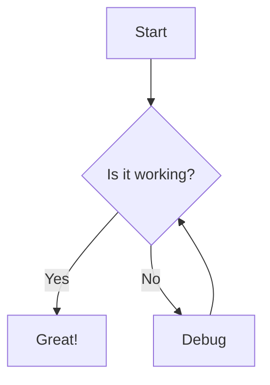

# vitepress-plugin-mermaid-tuck

Render Mermaid diagrams in your VitePress site.

在 VitePress 中渲染 Mermaid 图表。

## Usage

### With Vitepress-tuck

**Installation:**

```bash
# npm
npm install -D vitepress-tuck vitepress-plugin-mermaid-tuck
# pnpm
pnpm add -D vitepress-tuck vitepress-plugin-mermaid-tuck
# yarn
yarn add -D vitepress-tuck vitepress-plugin-mermaid-tuck
```

**Configuration:**

```ts
// .vitepress/config.ts
import mermaid from 'vitepress-plugin-mermaid-tuck'
import { defineConfig } from 'vitepress-tuck'

export default defineConfig({
  plugins: [mermaid()],
})
```

```ts
// .vitepress/theme/index.ts
import type { Theme } from 'vitepress'
import enhanceApp from 'virtual:enhance-app'
import DefaultTheme from 'vitepress/theme'

export default {
  extends: DefaultTheme,
  enhanceApp(ctx) {
    enhanceApp(ctx)
  },
} satisfies Theme
```

### With Vitepress

**Installation:**

```bash
# npm
npm install -D vitepress-plugin-mermaid-tuck
# pnpm
pnpm add -D vitepress-plugin-mermaid-tuck
# yarn
yarn add -D vitepress-plugin-mermaid-tuck
```

**Configuration:**

```ts
// .vitepress/config.ts
import { defineConfig } from 'vitepress'
import { mermaidMarkdownPlugin, mermaidVitePlugin } from 'vitepress-plugin-mermaid-tuck'

export default defineConfig({
  markdown: {
    config: (md) => {
      md.use(mermaidMarkdownPlugin)
    },
  },
  vite: {
    plugins: [mermaidVitePlugin()],
  },
})
```

```ts
// .vitepress/theme/index.ts
import type { Theme } from 'vitepress'
import { enhanceAppWithMermaid } from 'vitepress-plugin-mermaid-tuck/client'
import DefaultTheme from 'vitepress/theme'

export default {
  extends: DefaultTheme,
  enhanceApp(ctx) {
    enhanceAppWithMermaid(ctx)
  },
} satisfies Theme
```

## Syntax

Use `mermaid` code blocks to render diagrams.

````md

````

### Configuration

You can pass Mermaid options to the plugin:

```ts
mermaid({
  options: {
    themeVariables: {
      primaryColor: '#3b82f6',
    },
  },
  locales: {
    'zh-CN': {
      chart: '图表',
      source: '代码',
      fullscreen: '全屏',
      download: '下载',
    },
  },
})
```

Or override options at runtime in your theme:

```ts
// .vitepress/theme/index.ts
import { defineMermaidOptions } from 'vitepress-plugin-mermaid-tuck/client'

defineMermaidOptions({
  securityLevel: 'loose',
})
```

The component provides Chart/Code tab switching, fullscreen mode, and SVG download.
