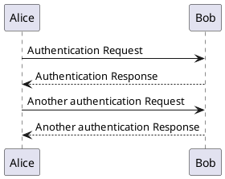
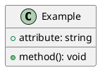

# vitepress-plugin-plantuml

Render PlantUML diagrams in your VitePress site.

在 VitePress 中渲染 PlantUML 图表。

## Usage

### With Vitepress-tuck

**Installation:**

```bash
# npm
npm install -D vitepress-tuck vitepress-plugin-plantuml
# pnpm
pnpm add -D vitepress-tuck vitepress-plugin-plantuml
# yarn
yarn add -D vitepress-tuck vitepress-plugin-plantuml
```

**Configuration:**

```ts
// .vitepress/config.ts
import plantuml from 'vitepress-plugin-plantuml'
import { defineConfig } from 'vitepress-tuck'

export default defineConfig({
  plugins: [plantuml()],
})
```

```ts
// .vitepress/theme/index.ts
import type { Theme } from 'vitepress'
import enhanceApp from 'virtual:enhance-app'
import DefaultTheme from 'vitepress/theme'

export default {
  extends: DefaultTheme,
  enhanceApp(ctx) {
    enhanceApp(ctx)
  },
} satisfies Theme
```

### With Vitepress

**Installation:**

```bash
# npm
npm install -D vitepress-plugin-plantuml
# pnpm
pnpm add -D vitepress-plugin-plantuml
# yarn
yarn add -D vitepress-plugin-plantuml
```

**Configuration:**

```ts
// .vitepress/config.ts
import { defineConfig } from 'vitepress'
import { plantumlMarkdownPlugin, plantumlVitePlugin } from 'vitepress-plugin-plantuml'

export default defineConfig({
  markdown: {
    config: (md) => {
      md.use(plantumlMarkdownPlugin)
    },
  },
  vite: {
    plugins: [plantumlVitePlugin()],
  },
})
```

```ts
// .vitepress/theme/index.ts
import type { Theme } from 'vitepress'
import { enhanceAppWithPlantuml } from 'vitepress-plugin-plantuml/client'
import DefaultTheme from 'vitepress/theme'

export default {
  extends: DefaultTheme,
  enhanceApp(ctx) {
    enhanceAppWithPlantuml(ctx)
  },
} satisfies Theme
```

## Syntax

Use `plantuml` code blocks to render diagrams.

````md

````

### Output Format

You can specify the output format (`svg` or `png`) for individual diagrams:

````md

````

Or set a global default when configuring the plugin:

```ts
plantuml('png') // default is 'svg'
```

Supported formats: `svg`, `png`

## Features

- **Dark / Light mode** — Automatically generates both dark and light variants of diagrams, matching the current VitePress theme.
- **Chart / Source tabs** — Toggle between the rendered diagram and its source code.
- **Fullscreen mode** — Click the fullscreen button to view the diagram in a full-screen overlay.
- **Download** — Download the current diagram as an image file.
- **Multi-language** — Built-in support for English, Chinese, Japanese, Korean, Spanish, French, Russian, German, and Portuguese.
- **SVG optimization** — SVGs are automatically optimized via SVGO for cleaner output.
- **Caching** — Rendered diagrams are cached to disk for fast rebuilds.
